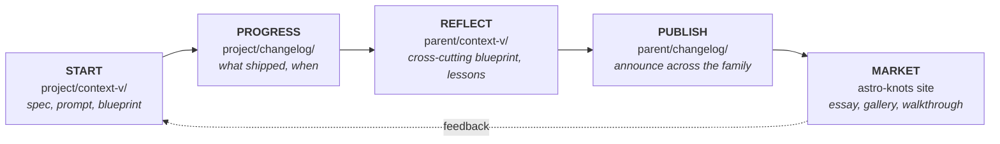

# Pseudomonorepos

> Not a true monorepo. Not loosely coupled either. A parent repo that adds children (often as git submodules) primarily so the parent can host a `context-v/` that aggregates context across them.

## When to use this skill

- Working **anywhere** under `~/code/lossless-monorepo/` or any of its descendants
- Starting any task — coding, writing a spec, drafting a prompt, debugging — that might overlap with prior work elsewhere in the tree
- Scaffolding a new sub-project (where does it go? does it deserve its own pseudomonorepo level?)
- User mentions "pseudomonorepo", "submodule", "the tree", or any of the named children
- Considering whether to add a folder/repo as a submodule vs. inline

## The behavioral core (this is the actual skill)

**Don't rush into creating.** Before writing a new spec, prompt, blueprint, doc, or substantial code:

1. **Walk the tree up.** Identify which pseudomonorepo level you're in. Walk to the root.
2. **Search prior work** at every level's `context-v/`:
   - Specs, blueprints, prompts, explorations, issues
   - Filenames (use grep/find by topic keywords)
   - Frontmatter tags
3. **Surface what you find** to the user. "I see related work in `astro-knots/context-v/blueprints/X.md` and `lossless-monorepo/context-v/explorations/Y.md` — should we extend those, link to them, or write something new?"
4. **Cross-reference, don't duplicate.** Link to prior work using `[[wikilinks]]`. Re-stating without linking is a smell.

### The escape hatch: ship fast

Sometimes assembling patterns, finding prior work, and writing context-v files **slows speed to ship**. That's a real tradeoff. When the user signals "just ship it":

- **Acknowledge** you're shortcutting the search-first discipline
- **Ship**
- **Log refactor debt** in the relevant `context-v/issues/` or `context-v/explorations/` as a one-liner: *"Shipped X without searching for prior patterns. Refactor candidate: connect to existing work in [[…]]?"*
- **Don't pretend you did the search.** Honesty about the shortcut is what makes the refactor possible.

We aspire to refactor afterwards — to make sense of things, connect them, write the missing blueprint, file the reminder. Speed-to-ship is granted; amnesia is not.

## What a pseudomonorepo looks like

```
pseudomonorepo/
├── .git
├── .gitmodules            # children referenced as submodules (sometimes)
├── context-v/             # PARENT-level context spanning children
│   ├── specs/
│   ├── blueprints/        # cross-cutting patterns across children
│   ├── prompts/
│   ├── reminders/
│   ├── explorations/
│   └── issues/
├── changelog/             # ship log — see Universal directories below
├── child-a/               # submodule, has its own context-v/ + changelog/
├── child-b/               # submodule, has its own context-v/ + changelog/
└── child-c/               # could itself be a pseudomonorepo (nested)
```

Each level is authoritative for its own scope. Children own their internals. The parent owns the *space between* children.

## Universal directories — every repo level should have both

**Aspiration:** every pseudomonorepo, true monorepo, *and* project repo has these two top-level siblings:

| Directory | Purpose |
|---|---|
| `context-v/` | Living documentation (specs, prompts, blueprints, reminders, explorations, issues). See `context-vigilance` skill. |
| `changelog/` | Ship log — dated records of what changed and when. The progress trail. |

**Reality:** placement of `changelog/` varies. Some projects have it nested at `context-v/changelog/`, some have it parallel at the repo root. **Aspiration is parallel.** When working in a project, respect the existing placement; only normalize when explicitly asked.

When scaffolding a new repo at any level, create both as siblings at the root.

## The 5-phase lifecycle workflow

The canonical loop for any meaningful unit of work in the Lossless ecosystem:

```
┌──────────┐    ┌──────────┐    ┌──────────┐    ┌──────────┐    ┌──────────┐
│  START   │ →  │ PROGRESS │ →  │ REFLECT  │ →  │ PUBLISH  │ →  │  MARKET  │
│          │    │          │    │          │    │          │    │          │
│ project/ │    │ project/ │    │ parent/  │    │ parent/  │    │ astro-   │
│ context- │    │ change-  │    │ context- │    │ change-  │    │ knots    │
│ v/       │    │ log/     │    │ v/       │    │ log/     │    │ site     │
└──────────┘    └──────────┘    └──────────┘    └──────────┘    └──────────┘
     ↑                                                                  │
     └──────────── feedback / next iteration ──────────────────────────────────────┘
```



**Phase definitions:**

| Phase | Where | What |
|---|---|---|
| **Start** | `project/context-v/` | Write the spec, prompt, or blueprint that frames the work |
| **Progress** | `project/changelog/` | Log what shipped and when, with links back to the spec |
| **Reflect** | `parent-pseudomonorepo/context-v/` | Lift learnings to the cross-cutting level: new blueprints, refined patterns |
| **Publish** | `parent-pseudomonorepo/changelog/` | Announce the change at the family level |
| **Market** | An [Astro Knots](https://www.lossless.group/projects/gallery/astro-knots) site | Public-facing essay, gallery entry, or walkthrough where it fits |

Not every unit of work runs the full loop. Small fixes might stop at Progress. Significant patterns should run all five. **The loop is aspiration, not mandate.** But every phase skipped is a candidate for refactor debt (see `references/search-first.md`).

A dedicated **`lossless-loop`** (working title) skill is forthcoming to fully encode this workflow.

## Nested pseudomonorepos

The hierarchy can be:

```
root pseudomonorepo
└── theme-level pseudomonorepo
    └── collection-level pseudomonorepo
        └── true monorepo (npm workspaces, etc.)
            └── individual project / repo
```

Not every project sits at every level. The point is: **walk up until you stop finding `context-v/`** to be sure you've checked all relevant context.

## The current tree (snapshot)

The anchor pseudomonorepo is **`lossless-monorepo`** (<https://github.com/lossless-group/lossless-monorepo>), locally at `~/code/lossless-monorepo/` (paths vary on collaborators' machines).

Rank-ordered children (most relevant first):

| Path | Intent |
|---|---|
| `ai-labs/` | Work where we monkey with AI + Agents on complex workloads |
| `astro-knots/` | The family of websites — feature-rich, opinionated |
| `content-farm/` | Currently almost entirely Obsidian plugins (we use Obsidian for content) |
| `tidyverse/` | Tools, libs, scripts for cleaning up other things |

For details, current state, and intent-vs-reality notes, see `references/the-tree.md`.

> **Honest note:** The root and most pseudomonorepos are **imperfectly maintained**. Don't assume `context-v/` is complete or current. Search it; treat what you find as starting points; surface gaps when you see them.

> **Drift policy:** Walking the tree will reveal far more inconsistencies than consistencies. **Observe, note, surface — but do not auto-clean** as a side effect of unrelated work. Normalization is a separate, explicitly-authorized task. The user runs parallel agent sessions; silent fixes break others' work. Full policy in `~/.pi/agent/AGENTS.md`.

## Cross-skill ties

This skill is **not a silo** — it composes with the others:

- **`context-vigilance`** — pseudomonorepos exist primarily to host parent-level `context-v/`. The two are two halves of the same idea: this skill says *where* to look and *when* to look up; `context-vigilance` says *what* the docs you find should look like.
- **`astro-knots`** — `astro-knots/` is one of the four children. Working in any Astro Knots site means walking up to `lossless-monorepo/` for cross-site context.
- **`lfm`** (forthcoming) — likely lives within `astro-knots/` or as its own child.

When working in this tree, **multiple skills apply at once.** Don't pick one — let them all inform what you do.

## Typical flow when starting a task

1. **Locate yourself.** `pwd`. Walk up. Note which pseudomonorepo level(s) sit above you.
2. **Quick scan** of each level's `context-v/`:
   ```bash
   for dir in $(walk-up-to-root); do
     ls "$dir/context-v/" 2>/dev/null
   done
   ```
3. **Topic search** by keyword:
   ```bash
   grep -ril "keyword" $(find ~/code/lossless-monorepo -type d -name context-v 2>/dev/null)
   ```
4. **Report findings** to the user. Even if you find nothing — confirm the search ran.
5. **Ask:** extend / link / write new?
6. **Proceed**, applying `context-vigilance` conventions to whatever you write.
7. **If shipping fast,** note the skipped search as refactor debt.

## See also

- `references/anatomy.md` — what makes something a pseudomonorepo, identification heuristics
- `references/the-tree.md` — current state of the lossless-monorepo tree (living doc)
- `references/search-first.md` — concrete recipes for finding prior work
- `references/lifecycle-workflow.md` — the 5-phase Start → Progress → Reflect → Publish → Market loop, with diagrams
- `context-vigilance/SKILL.md` — the documentation framework that `context-v/` follows
- `astro-knots/SKILL.md` — the websites child of the tree
